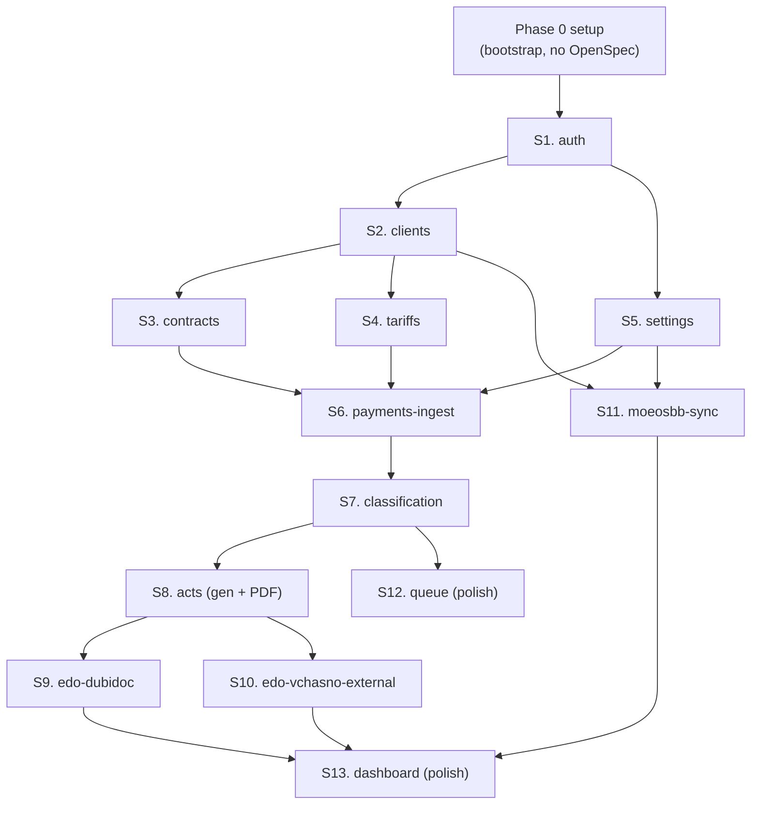

# MVP Capability Plan (Phase 0)

**Версія:** 1.0
**Дата:** 2026-05-22
**Скоуп:** тільки Phase 0 (MVP) з [`prd.md`](prd.md) § 6 / [`prd-rationale.md`](prd-rationale.md) § 11. Phase 1/2/3 — окремий roadmap, повертаємось після Phase 0 ship.

---

## 0. Як читати цей документ

Документ розрізає Phase 0 на **capability slices** — вертикальні зрізи UI → API → Domain → DB → Tests → Docs, які деплояться по одному PR і дають окрему demo recording. Порядок витікає з **explicit dependency graph** у § 3, а не з шарів технології.

- **Capability ≠ change.** Capability — це юзер-видима функція ("admin може створити клієнта"). Change у OpenSpec-термінах — артефакт реалізації; одна capability = один change. Cross-cutting інфраструктура може мати **infra-change** без власного capability slice (§ 2).
- **PR := capability := demo recording := `current-state.md` оновлення.** Якщо не вкладається в один PR — потрібно розрізати ще.
- **`app/(<slice>)/<name>/`** — конвенція з [`AGENTS.md`](../AGENTS.md). Капабіліті живе у власному route-group-фолдері; `lib/*` — спільна інфраструктура.
- **Перед стартом зрізу** агент створює OpenSpec change через `Skill(openspec:propose)` → `proposal.md`, `design.md`, `tasks.md`, `spec.md` за дві сесії (Day 1 morning → Day 2 morning по слайдах презентації). Після implementation і Definition of Done (§ 6) — `openspec archive` + оновлення [`current-state.md`](current-state.md).

---

## 1. Принципи slicing (нагадування)

**Що таке capability slice** (з референс-презентації):

| Шар          | Артефакт у slice                                       |
| ------------ | ------------------------------------------------------ |
| UI           | routes + компоненти з `DESIGN.md` токенами             |
| API          | server actions / route handlers / cron handlers        |
| Domain logic | services, validation, бізнес-правила                   |
| DB           | schema + міграція                                      |
| Tests        | unit + smoke на реальній БД + E2E для критичних шляхів |
| Docs         | OpenSpec proposal/design/tasks/spec + demo recording   |

**Self-contained** — slice можна задеплоїти в production одразу після merge, навіть якщо наступні зрізи не зробили.

**Анти-патерни slicing** (не робимо):

- ❌ **Layer-based** — "спочатку всі моделі, потім всі API, потім UI". Інтеграційний ризик у кінці.
- ❌ **Technology-based** — "спочатку фронт, потім бек". Те ж саме.
- ❌ **Spike-then-implement** — прототип без тестів іде в prod.
- ❌ **One giant migration** — неможливо відкотити частково.
- ❌ **"Just one more feature"** — додавання scope під час slice. Скоуп фіксується у `proposal.md` і не росте.

---

## 2. Cross-cutting concerns (НЕ capability)

Інфраструктура для багатьох capabilities — **це не slice**. Будується за одним з трьох рецептів (зі слайду 7 презентації):

| Тип concern                           | Рецепт                                                               | Куди живе у нашому проекті                                                                                                            |
| ------------------------------------- | -------------------------------------------------------------------- | ------------------------------------------------------------------------------------------------------------------------------------- |
| Каркас, naming, гайдрейли             | **Без OpenSpec у Phase 0 setup**                                     | `lib/` shape, `AGENTS.md` rules, lint rules, DESIGN tokens у Tailwind config                                                          |
| Стабільний контракт (Given/When/Then) | **Infra-spec у `openspec/specs/<infra>/`** + власні OpenSpec changes | `openspec/specs/auth/`, `openspec/specs/logging/` коли контракт стабілізується                                                        |
| Розширення під конкретну capability   | **Один OpenSpec change → дві deltas**                                | Наприклад, `add-clients` зачіпає і `specs/clients/`, і `specs/auth/` для нових RBAC-rules (у нас single-admin, але pattern лишається) |

**Наш реєстр cross-cutting:**

| Локація                         | Що це                                                                 | Коли з'являється                                |
| ------------------------------- | --------------------------------------------------------------------- | ----------------------------------------------- |
| `lib/db/`                       | Postgres-клієнт, транзакційні хелпери, міграційний раннер             | Phase 0 setup                                   |
| `lib/auth/`                     | session helpers, `getSession()`, middleware/proxy, rate-limit counter | Slice 1 (auth)                                  |
| `lib/logging/`                  | structured JSON logger (pino), redact-rule для secrets                | Phase 0 setup                                   |
| `lib/observability/`            | `integration_health` writes (last_success_at / last_error_at)         | Phase 0 setup; читається з Slice 13 (dashboard) |
| `lib/blob/`                     | Vercel Blob wrapper (upload, signed download URL)                     | Slice 8 (acts)                                  |
| `lib/pdf/`                      | React + Tailwind → headless Chromium (`@sparticuz/chromium`)          | Slice 8 (acts)                                  |
| `lib/external-apis/privatbank/` | HTTP-клієнт ПриватБанк Автоклієнт API, retry/backoff, error mapping   | Slice 6 (payments-ingest)                       |
| `lib/external-apis/dubidoc/`    | HTTP-клієнт Дубідок API                                               | Slice 9 (edo-dubidoc)                           |
| `lib/external-apis/moeosbb/`    | MySQL read-only client                                                | Slice 11 (moeosbb-sync)                         |
| `lib/i18n/`                     | UA-only стартово; pattern для майбутнього                             | Phase 0 setup (scaffold)                        |
| `proxy.ts` (Next.js 16)         | route protection, redirect на /login                                  | Slice 1 (auth)                                  |

**Правило**: якщо щось викликає ≥ 2 capabilities — це не capability, це `lib/`. Якщо потрібен verifiable contract — додаємо `openspec/specs/<infra>/` пізніше.

---

## 3. Dependency graph

**Читання графа:**

- **Auth-перший** (S1) — гейтує все: без сесії жодна сторінка не відкривається.
- **S2 (clients)** і **S5 (settings)** можна паралелити після S1, але клієнти важливіші — settings має малу UI-площу і малий ризик.
- **S3 (contracts)** і **S4 (tariffs)** паралеляться після S2 (обидва залежать від клієнтів, але не одне від одного).
- **S6 (payments-ingest)** чекає на classifier-related settings (S5) + contracts (S3) + tariffs (S4) — інакше класифікатор у S7 не матиме на чому матчити.
- **S7 → S8** — критичний шлях. Якщо щось ламається в acts (PDF, нумерація, snapshot) — це найризикованіший зріз.
- **S9 (Dubidoc)** і **S10 (Vchasno)** паралеляться після S8. Дубідок-зріз — найбільший по API; Вчасно — найменший.
- **S11 (moeosbb-sync)** — окрема паралельна гілка від S2 + S5. Може робитись паралельно з S6-S8.
- **S12 і S13** — polish-зрізи в кінці; розрізають за дві паралельні гілки.

**Стартова послідовність для one-dev solo flow** (без паралелізації):
S0 → S1 → S2 → S3 → S4 → S5 → S6 → S7 → S8 → S9 → S10 → S11 → S12 → S13

**Якщо появиться другий dev** — паралелити можна так:

- track A: S3 → S4 (один dev)
- track B: S5 (інший dev), потім S11 (паралельно з S6-S8)
- після злиття S2-5: обидва трeки сходяться у S6

---

## 4. Phase 0 setup (slice 0 — bootstrap)

**НЕ capability**, без OpenSpec change. Перший PR до будь-якого slice.

**Скоуп:**

- Next.js 16 App Router scaffolding узгоджено з [`AGENTS.md`](../AGENTS.md) і "This is NOT the Next.js you know" rules.
- Postgres connection (Neon через Vercel Marketplace), `POSTGRES_URL` env.
- Tailwind + shadcn/ui ініціалізація; токени з [`DESIGN.md`](../DESIGN.md) винесено у Tailwind config (custom colors / typography scale / spacing).
- `lib/` folder shape (порожні index.ts з TODO-коментарями для майбутніх модулів):
  - `lib/db/` (готовий клієнт + транзакційний хелпер)
  - `lib/logging/` (готовий pino-логер з redact)
  - `lib/observability/` (готовий `integration_health` writer + миграція таблиці)
  - `lib/auth/`, `lib/blob/`, `lib/pdf/`, `lib/external-apis/`, `lib/i18n/` — порожні shell для майбутніх slices
- `proxy.ts` стаб (повертає `next()` для всього — реальна логіка приходить з S1).
- `vercel.ts` конфіг з порожнім `crons: []` (наповнюється slices).
- ESLint rules для import-boundaries з `AGENTS.md` (`app/` не імпортує з `app/api/internals/`; `lib/` не імпортує з `next/*`).
- `.github/workflows/ci.yml` — lint + typecheck + build.
- [`current-state.md`](current-state.md) створено з порожнім schema.
- [`qa/recordings/`](qa/recordings/) folder створено.
- Vercel project linked; env-змінні bootstrap (`POSTGRES_URL` auto з Neon Marketplace; інші — placeholder).

**Definition of done для Phase 0 setup:**

- `npm run build` зелений.
- `npm run lint` зелений з усіма правилами.
- `vercel deploy` (preview) робить успішний deploy порожнього додатку.
- /api/health повертає `{ status: 'ok' }`.
- `current-state.md` має запис "Phase 0 setup complete; next: S1 (auth)".

---

## 5. Capability slices (S1 — S13)

Деталі кожного зрізу. Точний скоуп уточнюється у відповідному `openspec/changes/add-<slice>/proposal.md` під час Day 1 morning.

---

### S1. auth

**Що:** адмін логіниться через email/password, отримує session-cookie, бачить порожній дашборд.

**PRD coverage:** FR-AUTH-01..06; NFR-SEC-01..04; частина NFR-AVAIL-06 (`/api/health`).

**Depends on:** Phase 0 setup.

**Deliverables:**

- **UI:** `app/(auth)/login/page.tsx`. Дашборд `app/(dashboard)/page.tsx` — порожній stub з повідомленням "Підключіть інтеграції".
- **API:** server actions `signIn`, `signOut`.
- **Domain:** argon2id verify, session generate/validate, IP-based rate limiter (10/година).
- **DB:** міграція — `sessions(token_hash, expires_at, created_at, ip)`, `login_attempts(ip, attempted_at)`.
- **Lib brings:** `lib/auth/` (повний реалізований), `proxy.ts` (захищає всі routes крім `/login`, `/api/health`).
- **Tests:** unit (argon2 verify, session HMAC), smoke (login → access dashboard → logout), E2E (rate-limit after 10 fail).
- **Docs:** demo recording — login success, login failure, rate-limit, logout.

**Demo criteria:** з env-змінних `ADMIN_EMAIL` + `ADMIN_PASSWORD_HASH` адмін логіниться, потрапляє на `/`, виходить.

**Cross-cutting brings in:** `lib/auth/*`, `proxy.ts`.

---

### S2. clients

**Що:** адмін веде картотеку клієнтів вручну — створення, редагування, архівування, фільтри.

**PRD coverage:** FR-CLI-01..11; BC-DATA-03; BC-USER-03; (поля `edo_provider` вже у схемі з default `dubidoc`, але keep dormant).

**Depends on:** S1.

**Deliverables:**

- **UI:** `app/(clients)/clients/page.tsx` (список + фільтри), `app/(clients)/clients/[id]/page.tsx` (картка з tabs — інфо, Договір/Платежі/Акти як stubs), `app/(clients)/clients/new/page.tsx`.
- **API:** server actions `createClient`, `updateClient`, `archiveClient`, `linkToMoeosbb`.
- **Domain:** validation (`legal_id` як 8 або 10 цифр; email; uniqueness на `moeosbb_user_id`).
- **DB:** міграція — Postgres ENUM `edo_provider`, table `clients`, FK constraints stubs (поки немає contracts/payments/acts).
- **Tests:** unit (validation), smoke (CRUD round-trip), E2E (створення з форми, фільтр Archive vs Active).
- **Docs:** demo — створення клієнта з нуля; архівування; фільтр.

**Demo criteria:** адмін заводить клієнта вручну; редагує `apartments_count`, `edo_provider`, `auto_act_disabled`; архівує і знаходить у фільтрі Archive.

**Cross-cutting brings in:** —

---

### S3. contracts

**Що:** адмін прив'язує до клієнта 0 або 1 договір.

**PRD coverage:** FR-CTR-01..06; FR-CLI-11 (warning без договору).

**Depends on:** S2.

**Deliverables:**

- **UI:** `app/(contracts)/contracts/page.tsx`, форма embedded у картці клієнта; preview iframe для PDF якщо є `file_url`.
- **API:** server actions `createContract`, `updateContract`, `deleteContract`.
- **Domain:** unique `(client_id)` (1:0..1), validation `signed_date`.
- **DB:** міграція — table `contracts`, FK `client_id` ON DELETE RESTRICT.
- **Tests:** unit (cardinality), smoke (CRUD + delete-blocked коли є акти — як negative test, бо acts ще немає, заглушка manual).
- **Docs:** demo — створення договору; warning у клієнта без договору.

**Demo criteria:** адмін додає договір до клієнта; редагує; видаляє (поки не блокується, бо acts немає).

**Cross-cutting brings in:** —

---

### S4. tariffs

**Що:** адмін керує тарифною сіткою (`Tariff`) і ціновою історією СМС (`SmsPrice`); резолвер ціни працює і покритий тестами.

**PRD coverage:** FR-TAR-01..10.

**Depends on:** S2 (бо override на Client).

**Deliverables:**

- **UI:** `app/(settings)/settings/tariffs/page.tsx`, `app/(settings)/settings/sms-prices/page.tsx`.
- **API:** server actions для CRUD `Tariff`, `SmsPrice`; перевірка `access_price_override` через картку клієнта.
- **Domain:** `resolveAccessPrice(client, payment_date)`, `resolveSmsPrice(payment_date)`, catch-all invariant.
- **DB:** міграції — `tariffs`, `sms_prices`; seed (1 catch-all `price=200`; 1 SmsPrice `price=1.40, effective_from='2024-01-01'`).
- **Tests:** unit (resolver з усіма пріоритетами override → ranged → catch-all; вибір версії по `effective_from`), invariant (заборона видалення останнього catch-all).
- **Docs:** demo — додавання ranged-правила, перевірка resolved price для різних `apartments_count`/`payment_date`.

**Demo criteria:** адмін додає ranged-правило `apartments_min=50, apartments_max=100, price=300`; для клієнта з `apartments_count=70` resolver повертає 300; для 150 — catch-all 200.

**Cross-cutting brings in:** —

---

### S5. settings

**Що:** адмін редагує classifier-параметри (regex-патерни, sms-keywords, transit-edrpou) і polling/sync інтервали.

**PRD coverage:** FR-SET-01..07 (крім тарифних — це S4).

**Depends on:** S1.

**Deliverables:**

- **UI:** `app/(settings)/settings/patterns/page.tsx` (CRUD regex + test-area), `app/(settings)/settings/sms-keywords/page.tsx`, `app/(settings)/settings/transit-edrpou/page.tsx`, `app/(settings)/settings/integrations/page.tsx` (read-only статуси + інтервали).
- **API:** server actions для CRUD `settings` KV.
- **Domain:** validation (regex компілюється; numeric ranges для інтервалів).
- **DB:** міграція — `settings(key TEXT PRIMARY KEY, value JSONB, updated_at)`; seed (regex patterns зі стартового набору, `sms_keywords`, `transit_edrpou_list=["14360570"]`, інтервали).
- **Tests:** unit (regex validation; range validation), smoke (CRUD).
- **Docs:** demo — додавання нового regex pattern + test проти прикладу purpose.

**Demo criteria:** адмін додає regex `/^Опл.*договір\s*[№#]\s*(\d{6})/i`, test-area показує match на прикладі `"Оплата по договір №556770"`.

**Cross-cutting brings in:** —

---

### S6. payments-ingest

**Що:** Cron-задача polling ПриватБанку записує платежі; адмін бачить їх у `/payments` зі статусом `received`.

**PRD coverage:** FR-PAY-01..08; NFR-PERF-01; TC-INTEG-01, TC-INTEG-10.

**Depends on:** S3, S4, S5 (settings polling_interval).

**Deliverables:**

- **UI:** `app/(payments)/payments/page.tsx` (список + фільтри), `app/(payments)/payments/[id]/page.tsx` (картка з `raw_data` JSON, без manual classification — це S7).
- **API:** cron handler `app/api/cron/privatbank-poll/route.ts` (зареєстровано в `vercel.ts`); server action `triggerPrivatbankPollNow` для кнопки на дашборді.
- **Domain:** parse PrivatBank payload → `Payment` fields; idempotent INSERT `ON CONFLICT (bank_transaction_id) DO NOTHING`; overlapping window (2× interval).
- **DB:** міграція — table `payments` зі статусом enum + `raw_data jsonb` + UNIQUE `bank_transaction_id`.
- **Lib brings:** `lib/external-apis/privatbank/` (HTTP-клієнт + retry/backoff + error mapping; реюз patterns з `~/Projects/privatbank-telegram-bot`).
- **Observability:** cron handler оновлює `integration_health(service='privatbank')` після кожного циклу.
- **Tests:** unit (mapping payload → Payment; idempotency на дублі), smoke з mock HTTP (token rotation 401, 429, 5xx), E2E (видимий запис у `/payments` після manual trigger).
- **Docs:** demo — manual trigger через дашборд → новий платіж у `/payments` за хвилину.

**Demo criteria:** З mock-сервера або стейджінгового PrivatBank token приходить транзакція → запис з усіма полями з'являється у `/payments`.

**Cross-cutting brings in:** `lib/external-apis/privatbank/*`; перший cron у `vercel.ts`.

**Ризики / TBD:** доступ до реального PrivatBank API в production. Якщо для smoke потрібен stagging-token — потрібно з'ясувати в Day 1 design.md.

---

### S7. classification

**Що:** Платіж зі статусом `received` автоматично проходить класифікатор → `classified` (з акт-stub) АБО `awaiting_review` / `in_queue` з reason; адмін може вручну resolve через картку платежу.

**PRD coverage:** FR-CLASS-01..18; FR-EDGE-03.

**Depends on:** S6, S2, S3, S4, S5.

**Deliverables:**

- **UI:** на картці платежу — форма ручної класифікації (`/payments/[id]` отримує action panel); базовий список `/payments?status=in_queue` (повноцінна queue UI приходить у S12).
- **API:** server action `classifyPayment(paymentId)` (виклик автоматично після ingest і вручну); server action `skipPayment(paymentId)`.
- **Domain:** повний класифікатор за 8 кроків (4.1 PRD-rationale) — regex parse, dedup + multiple_contracts, 2FA matching, transit, completeness check, `service_type` detection, tariff resolve, quantity calc. Все в Postgres-транзакції з `FOR UPDATE`.
- **DB:** міграція — додати fields `Payment.status`, `classification_reason`, `parsed_contract_numbers`, `client_id`, `service_type`, `unit_price`, `quantity`, `quantity_unit`, `act_id`. Створення Act-stub-row для `classified` (без PDF поки — це S8; `pdf_file_url=NULL`, `edo_doc_id=NULL`).
- **Tests:** **повне покриття всіх reason-гілок** (no_match, multiple_contracts, ambiguous_client, client_incomplete, auto_act_disabled, external_edo, amount_mismatch, sms_quantity_mismatch). Smoke на реальній БД: створити клієнта + договір + платіж з 5 типів purpose → перевірити reason / status. E2E: ручний resolve `no_match` через картку платежу.
- **Docs:** demo — два платежі: один проходить як `classified`, інший попадає в `in_queue(no_match)` → адмін прив'язує до клієнта → реруниться.

**Demo criteria:** Платіж з відомим клієнтом + договором → `classified`; платіж з невідомим ЄДРПОУ → `in_queue(no_match)`; ручний resolve запускає реrun і переводить у `classified`.

**Cross-cutting brings in:** —

**Ризики:** покриття всіх 8 reasons — найбільший за обсягом тестів зріз. Час Day 2-3 implementation може зайняти більше, ніж 2 дні.

---

### S8. acts (generation + PDF + list)

**Що:** Класифікований платіж → `Act` зі правильним номером, snapshot-полями і згенерованим PDF у Blob. `/acts` UI з картою + завантаженням PDF.

**PRD coverage:** FR-ACT-01..10; NFR-PERF-03; TC-INTEG-05, TC-INTEG-12.

**Depends on:** S7.

**Deliverables:**

- **UI:** `app/(acts)/acts/page.tsx` (список + фільтри), `app/(acts)/acts/[id]/page.tsx` (snapshot panel, download PDF, поки без EDO-кнопок).
- **API:** server actions `generateAct(paymentId, overrides?)` (виклик автоматично з S7; вручну для awaiting_review); `regeneratePdf(actId)` (тільки для vchasno_external — поки немає, але інфра готова).
- **Domain:** `nextActNumber(clientId, year, month)` під `FOR UPDATE` на acts; snapshot-копіювання (`client_snapshot`, `contract_snapshot`, `unit_price`, `quantity`, `edo_provider`); PDF render через React+Tailwind → Chromium.
- **DB:** міграція — actual `acts` table (раніше був stub з S7) + FK `RESTRICT` на client/payment, FK SET NULL `payments.act_id`, UNIQUE `(client_id, act_date, number)`.
- **Lib brings:** `lib/blob/`, `lib/pdf/` (з `@sparticuz/chromium` setup для Vercel Function).
- **Tests:** unit (act numbering race — паралельні INSERT через test transaction; snapshot immutability при подальшому update Client); smoke (повний цикл: classify → act → PDF у Blob → download з UI); E2E (download PDF з картки акту → файл відкривається).
- **Docs:** demo — повний пайплайн: створити клієнта + договір + tariff → ручний trigger ingest → платіж класифікується → акт `№M` з PDF у `/acts`; завантажити PDF і відкрити.

**Demo criteria:** Visual end-to-end на реальних даних: платіж → акт `№5` → PDF з правильними полями (як зразок `samples/acts/act-2026-04_200.pdf`).

**Cross-cutting brings in:** `lib/blob/*`, `lib/pdf/*`; Chromium runtime у Vercel Function.

**Ризики:** Chromium cold start у Vercel Function (NFR-PERF-03 цільовий 8s cold). Якщо проблема — fallback варіант обговорюється у Day 1 design.md.

---

### S9. edo-dubidoc

**Що:** Акт з `edo_provider=dubidoc` автоматично відправляється в Дубідок (`POST /documents`); cron polling оновлює статус (signed / archived / refused).

**PRD coverage:** FR-EDO-01..12; FR-EDGE-01; TC-INTEG-02, TC-INTEG-13.

**Depends on:** S8.

**Deliverables:**

- **UI:** на картці акту — кнопки "Перейти в Дубідок", "Оновити статус", "Спробувати ще раз" (для retry); банер "Клієнт відмовився" коли `edo_status=refused`.
- **API:** server action `sendToDubidoc(actId)` (виклик автоматично після створення Act у S8 → тут підключається); cron handler `app/api/cron/dubidoc-poll/route.ts`.
- **Domain:** request mapping (file base64, participants[] inline, signatureType external, workflowType sequential); response mapping (status / archived / refused → Act.status / edo_status); idempotency check (skip retry якщо `edo_doc_id IS NOT NULL`); polling-loop.
- **DB:** міграція — fields `Act.edo_doc_id`, `Act.edo_status` (text), `Act.sent_to_edo_at`.
- **Lib brings:** `lib/external-apis/dubidoc/` (HTTP-клієнт; реюз patterns з `~/Projects/zbory_v2`).
- **Observability:** обидва endpoints оновлюють `integration_health(service='dubidoc')`.
- **Tests:** unit (request payload assembly; response → status mapping для signed/archived/refused/інших); smoke (з mock Дубідок endpoint — повний цикл POST → polling GET → status update); E2E (натиснути "Спробувати ще раз" для failed send).
- **Docs:** demo — створити акт для клієнта з `edo_provider=dubidoc` → акт відправлено в Дубідок (mock) → polling-cycle → статус оновлено.

**Demo criteria:** Реальний акт у тестовому Дубідок-середовищі (sandbox token); видно у Дубідок UI; через 1-6 годин polling-cycle status стає `signed`.

**Cross-cutting brings in:** `lib/external-apis/dubidoc/*`; другий cron у `vercel.ts`.

**Ризики:** sandbox-token для Дубідок Premium API. Потрібно отримати/перевірити до start.

---

### S10. edo-vchasno-external

**Що:** Акт з `edo_provider=vchasno_external` лишається `draft`; адмін викачує PDF, підписує у Вчасно, натискає "Позначити підписаним" → `Act.status=signed`.

**PRD coverage:** FR-EDO-20..25; TC-INTEG-04.

**Depends on:** S8.

**Deliverables:**

- **UI:** на картці акту — кнопки "Позначити підписаним", "Скасувати позначку", "Перегенерувати PDF" (дозволено в будь-якому статусі); бейдж "Вчасно" у списку акт.
- **API:** server actions `markActSigned(actId)`, `unmarkActSigned(actId)`, `regeneratePdfVchasno(actId)`.
- **Domain:** state-machine `draft ↔ signed` для `edo_provider=vchasno_external`; перегенерація PDF не торкає snapshot.
- **DB:** без нових таблиць/полів — лише поведінка щодо `Act.status`.
- **Tests:** unit (state-machine transitions); smoke (повний flow без API-виклику); E2E (натискання "Позначити підписаним" → бейдж змінюється на "Підписано у Вчасно").
- **Docs:** demo — клієнт з `edo_provider=vchasno_external` → акт у `draft` без виклику Дубідок → manual flow марк-підпис → status `signed`.

**Demo criteria:** Без жодного API-виклику ззовні — лише локальне UI; стан акту проходить `draft → signed → draft (скасування) → signed`; PDF можна перегенерувати в `signed`.

**Cross-cutting brings in:** —

---

### S11. moeosbb-sync

**Що:** Cron syncs (раз/місяць за розкладом) MySQL "Моє ОСББ" → оновлює реквізити локальних клієнтів з `moeosbb_user_id IS NOT NULL`; manual trigger також працює.

**PRD coverage:** FR-SYNC-01..06; TC-INTEG-03.

**Depends on:** S2, S5.

**Deliverables:**

- **UI:** кнопка "Sync now" на дашборді, на `/clients`, на картці клієнта; `/settings/integrations` показує last_sync_at і поточний schedule.
- **API:** cron handler `app/api/cron/moeosbb-sync/route.ts`; server action `triggerMoeosbbSyncNow`.
- **Domain:** read-only SELECT з `osbb_users`; селективний UPDATE (виключаючи manual-only fields: `apartments_count`, `access_price_override`, `auto_act_disabled`, `edo_provider`); enum-розклад (`first`/`last`/`manual`).
- **DB:** field `Client.last_sync_at`; без нових таблиць.
- **Lib brings:** `lib/external-apis/moeosbb/` (MySQL клієнт).
- **Observability:** оновлення `integration_health(service='moeosbb')`.
- **Tests:** unit (selective field merge — manual-only не перезаписуються); smoke з local MySQL fixture; E2E (Sync now → бачимо updated reqs у картці клієнта).
- **Docs:** demo — змінити рядок у MySQL → Sync now → реквізити клієнта оновились; manual-only поля лишились.

**Demo criteria:** Адмін має sandbox MySQL з 2 рядками `osbb_users`; запускає Sync now; обидва клієнти отримують оновлені реквізити, але `apartments_count` лишається тим, що адмін вводив вручну.

**Cross-cutting brings in:** `lib/external-apis/moeosbb/*`; третій cron у `vercel.ts`.

**Ризики (TBD з PRD TC-INTEG-03):** мережевий доступ з Vercel у приватний MySQL "Моє ОСББ". Опції — IP whitelist (Vercel Pro), окремий sync-gateway на VPS, або реюз patterns з zbory_v2. Вирішується у Day 1 design.md S11.

---

### S12. queue (polish)

**Що:** Повноцінний `/queue` з двома вкладками, групуваннями по reason, inline-формами корекції. Замінює fallback `/payments?status=in_queue` з S7.

**PRD coverage:** FR-QUEUE-01..10.

**Depends on:** S7 (логіка готова), S2/S3 (інлайн-форми для редагування клієнт/договір).

**Deliverables:**

- **UI:** `app/(queue)/queue/page.tsx` з tabs "На апрув" (`awaiting_review`) і "Проблеми класифікації" (`in_queue`); group by `classification_reason`; reason-специфічні картки (no_match → пошук/створення; multiple_contracts → radio; ambiguous_client → comparison; client_incomplete → missing-список з deep-links у поля).
- **API:** server actions не змінюються (з S7); можливо нові short-cuts для inline-flow.
- **Domain:** missing-field calculation для `client_incomplete` (UI-on-the-fly).
- **DB:** без міграцій.
- **Tests:** E2E — повний flow для кожного reason у єдиному queue UI.
- **Docs:** demo — нагенерувати по платежу на кожен з 8 reasons → пройти по черзі resolve через queue UI; всі resolved за ≤ 2 хвилин на платіж.

**Demo criteria:** Адмін з queue UI без переходів на картки платежу resolve-ить по платежу на кожен reason; час на платіж ≤ 2 хв.

**Cross-cutting brings in:** —

---

### S13. dashboard (polish)

**Що:** Повноцінний дашборд з health-banners на кожну інтеграцію, лічильниками платежів/актів, останніми 10 платежами, кнопками manual sync.

**PRD coverage:** FR-UI-01..03; NFR-AVAIL-06 (`/api/health` тут вже не змінюємо, але джерело даних — `integration_health`).

**Depends on:** S6, S9, S11 (всі три інтеграції з health-даними).

**Deliverables:**

- **UI:** `app/(dashboard)/page.tsx` (raison d'être цього зрізу). Health banners з `integration_health`: ✓/✗ + last_success_at / last_error_message; counters; recent payments; sync buttons.
- **API:** read-only queries (можливо API route для real-time refresh або just RSC).
- **Domain:** aggregation queries.
- **DB:** без міграцій (`integration_health` table створено у Phase 0 setup).
- **Tests:** unit (counters), E2E (видно банери з правильним статусом після manual broken-token simulation).
- **Docs:** demo — break PrivatBank token → банер червоніє; manual sync; counters live.

**Demo criteria:** Адмін відкриває `/` і за 5 секунд розуміє стан системи: які інтеграції живі, скільки платежів чекають його, які акти не відправились.

**Cross-cutting brings in:** —

---

## 6. Definition of Done — per-slice чек-лист

Кожен PR з capability slice мерджиться тільки якщо:

- [ ] `openspec/changes/add-<slice>/proposal.md` заповнено (що і навіщо).
- [ ] `.../design.md` заповнено (як саме; decisions; trade-offs).
- [ ] `.../tasks.md` — атомарний checklist, **всі checkbox `[x]`**.
- [ ] `.../spec.md` — ADDED Requirements з Given/When/Then.
- [ ] **Static gates** зелені: `npm run lint && npm run typecheck && npm run test:run && npm run build` — exit 0.
- [ ] **Smoke на реальній БД**: створено / змінено / видалено дані; інваріанти перевірено.
- [ ] **E2E** для критичних шляхів (Playwright або Chrome DevTools MCP) — pass.
- [ ] `npx openspec validate add-<slice> --strict` — pass.
- [ ] **Demo recording** записано і покладено у [`docs/qa/recordings/`](qa/recordings/) як `S<NN>-<slice>.{mp4,webm}` або `.md` з кроками + GIF/screenshots.
- [ ] [`docs/current-state.md`](current-state.md) оновлено: `phase`, `last completed slice`, `next slice`, `blockers`.
- [ ] PR-опис посилається на FR/NFR/TC/BC IDs з [`prd.md`](prd.md), які зріз покриває.
- [ ] `npx openspec archive add-<slice>` виконано після merge.

---

## 7. Реєстр поточних відкритих питань (TBD)

Перенести у відповідний `proposal.md` / `design.md` під час відкриття конкретного зрізу:

| ID        | Зріз                 | Питання                                                                                      |
| --------- | -------------------- | -------------------------------------------------------------------------------------------- |
| TBD-S6-1  | S6 (payments-ingest) | Сandbox-доступ до PrivatBank Автоклієнт API на час розробки.                                 |
| TBD-S8-1  | S8 (acts)            | Cold-start Chromium у Vercel Function на ~8s — підтвердити чи потрібен попередній warm-up.   |
| TBD-S9-1  | S9 (edo-dubidoc)     | Sandbox-токен Дубідок Premium для smoke / E2E.                                               |
| TBD-S11-1 | S11 (moeosbb-sync)   | Мережевий доступ з Vercel у приватний MySQL "Моє ОСББ" — IP whitelist / sync-gateway / реюз. |

---

## 8. Roadmap (referенс)

Після завершення Phase 0 (всі S1-S13 merged, demo recordings є) — переходимо до Phase 1/2/3 з [`prd.md § 6`](prd.md). Кожна Phase 1+ capability відкривається тим же flow (proposal → design → tasks → spec → impl → smoke → demo → archive).

Поточні очевидні наступні capabilities (deferred з MVP):

- Bulk-операції на платежах (Phase 1).
- Перевипуск акту з нових реквізитів (FR-EDGE-02, Phase 1).
- Push-алерти на Telegram/email (Phase 2).
- Webhook від Дубідок як заміна polling (Phase 2).
- Fuzzy-матч по ПІБ для транзитних рахунків (Phase 2).
- 2FA (Phase 2).
- Повноцінна API-інтеграція з Вчасно (Phase 3).
